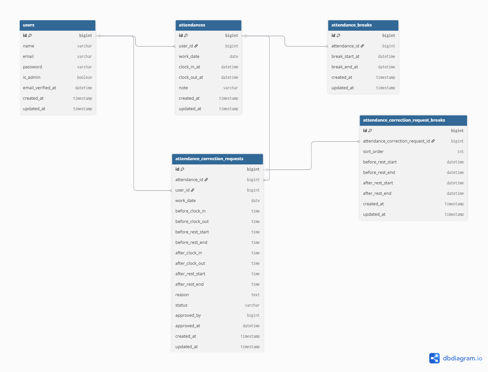

# 勤怠管理アプリ（attendance-app）

## 概要

Laravel + Docker 環境で構築した勤怠管理アプリです。
スタッフの打刻・勤怠管理・修正申請、および管理者による承認フローを実装しています。

---

## 主な機能

### ■ スタッフ

* 出勤 / 退勤 / 休憩の打刻
* 勤怠一覧（月別）
* 勤怠詳細確認
* 勤怠修正申請
* メール認証

---

### ■ 管理者

* 日別勤怠一覧
* スタッフ別勤怠一覧
* 勤怠詳細・編集
* 修正申請の承認 / 却下
* CSVエクスポート

※ 管理者はメール認証不要

---

## 技術スタック

* PHP 8.2
* Laravel
* MySQL 8.0
* Docker / Docker Compose
* Nginx
* MailHog

---

## 環境構築

### Docker起動

```bash
git clone https://github.com/kousukekunitomo/attendance-app
cd attendance-app
docker compose up -d --build
```

---

### Laravelセットアップ

```bash
docker compose exec app bash
composer install
cp .env.example .env
php artisan key:generate
php artisan migrate
php artisan db:seed
php artisan storage:link
```

---

## env設定

```env
APP_URL=http://localhost:8000

DB_CONNECTION=mysql
DB_HOST=db
DB_PORT=3306
DB_DATABASE=laravel_db
DB_USERNAME=laravel_user
DB_PASSWORD=secret

MAIL_MAILER=smtp
MAIL_HOST=mailhog
MAIL_PORT=1025
MAIL_FROM_ADDRESS=noreply@example.com
MAIL_FROM_NAME="Attendance App"
```

---

## メール認証

スタッフユーザーはメール認証が必要です。
MailHog を使用してメールを確認できます。

* MailHog: http://localhost:8025

---

## アクセスURL

* アプリ: http://localhost:8000
* ログイン: http://localhost:8000/login
* MailHog: http://localhost:8025
* phpMyAdmin: http://localhost:8080

---

## ログイン情報

### 管理者

* Email: `admin@test.com`
* Password: `password`

※ メール認証不要

---

## 設計ポイント

* 管理者とスタッフで認証フローを分離
* 管理者はメール認証不要とし業務フローを考慮
* 勤怠修正申請 → 承認フローを実装
* ルート・ミドルウェアで権限管理を分離

---

## ER図



---

## テスト実行

```bash
docker compose exec app php artisan test
```

---

## 注意事項

* `.env` はコミットしていません
* Docker環境が必要です
* 初回は migrate / seed を実行してください
